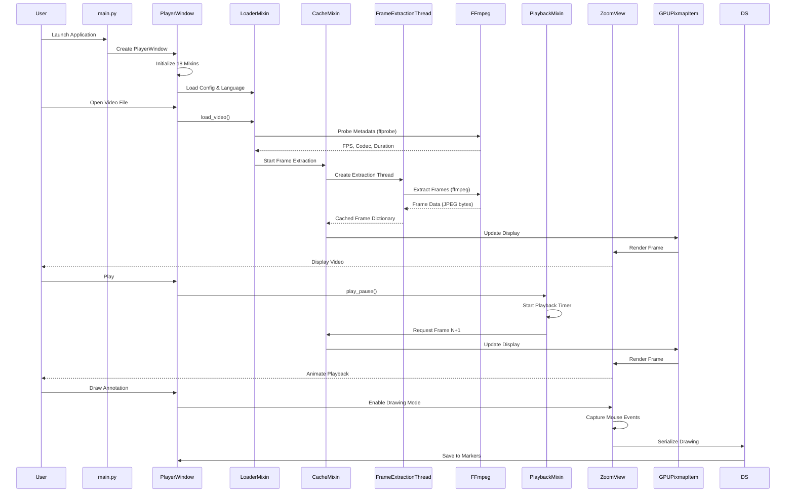

# Boomerang Player Architecture Diagram

## System Overview

Boomerang Player is a PyQt6-based frame-accurate video player built for professional motion analysis and annotation. The architecture uses a **multiple inheritance mixin pattern** to modularize functionality.

## Architecture Diagram

```mermaid
graph TB
    subgraph "Entry Point"
        MAIN[main.py<br/>Application Bootstrap]
    end

    subgraph "Core Window"
        PW[PlayerWindow<br/>Main Application Window]
    end

    subgraph "Mixin Layer (18 Mixins)"
        direction TB
        AM[AudioMixin<br/>Audio Handling]
        CM[CacheMixin<br/>Frame Extraction & Caching]
        PM[PlaybackMixin<br/>Play/Pause/Seek]
        LM[LoaderMixin<br/>Video Loading]
        TM[TransformMixin<br/>Rotate/Mirror]
        VM[VolumeMixin<br/>Volume Control]
        MM[MarkerMixin<br/>A/B Loop Markers]
        EFM[ExportFrameMixin<br/>Frame Export]
        ESM[ExportSegmentMixin<br/>Segment Export]
        PLM[PlaylistMixin<br/>Playlist Management]
        DM[DrawingMixin<br/>Annotation Tools]
        SM[SettingsMixin<br/>Settings Management]
        GSM[GlobalSettingsMixin<br/>Global Settings]
        ISM[IPCSyncMixin<br/>UDP Multi-Instance Sync]
        UM[UIMixin<br/>UI Initialization]
        SBM[SubtitleMixin<br/>Subtitle Handling]
        IM[AdjustmentMixin<br/>Image Adjustments]
        IAM[ImageAdjSettingsMixin<br/>Adjustment Settings]
    end

    subgraph "Components Layer"
        ZV[ZoomView<br/>GraphicsView with Zoom/Pan]
        GPI[GPUPixmapItem<br/>GPU-Accelerated Display]
        DS[DrawingSerializer<br/>Drawing Persistence]
        SR[SubtitleRenderer<br/>Subtitle Rendering]
        UI_COMPS[UI Components<br/>Sliders, Dialogs, Cards]
    end

    subgraph "Worker Layer"
        FET[FrameExtractionThread<br/>Background FFmpeg Processing]
    end

    subgraph "Supporting Modules"
        CFG[config.py<br/>Configuration Management]
        UTIL[utils.py<br/>Utilities & FFmpeg Paths]
        STYLES[styles.py<br/>Theming]
        TRANS[translations/<br/>Internationalization]
    end

    subgraph "External Dependencies"
        PYQT6[PyQt6<br/>GUI Framework]
        QFW[qfluentwidgets<br/>UI Components]
        FFMPEG[FFmpeg/FFprobe<br/>Video Processing]
        PYCAW[pycaw<br/>Windows Audio Control]
    end

    MAIN --> PW
    PW --> AM
    PW --> CM
    PW --> PM
    PW --> LM
    PW --> TM
    PW --> VM
    PW --> MM
    PW --> EFM
    PW --> ESM
    PW --> PLM
    PW --> DM
    PW --> SM
    PW --> GSM
    PW --> ISM
    PW --> UM
    PW --> SBM
    PW --> IM
    PW --> IAM

    UM --> ZV
    UM --> UI_COMPS
    CM --> GPI
    DM --> DS
    SBM --> SR
    CM --> FET

    PW --> CFG
    PW --> UTIL
    UM --> STYLES
    PW --> TRANS

    PW --> PYQT6
    UM --> QFW
    FET --> FFMPEG
    VM --> PYCAW
```

## Data Flow Diagram

## Key Architectural Patterns

### 1. Multiple Inheritance Mixin Pattern
The `PlayerWindow` class uses cooperative multiple inheritance with 18 mixins. Each mixin provides a specific domain of functionality:

- **Lifecycle Methods**: Mixins chain calls using `super()` to ensure proper initialization
- **Method Resolution Order (MRO)**: Critical for maintaining the inheritance chain
- **Separation of Concerns**: Each mixin handles one aspect (e.g., audio, caching, playback)

### 2. Frame-Accurate Caching System
- **CacheMixin**: Manages frame extraction and caching
- **FrameExtractionThread**: Background thread using FFmpeg to extract frames
- **Sliding Window Cache**: Maintains a cache window around current playback position
- **Zero-Drift Playback**: Uses ffprobe metadata for frame-accurate seeking

### 3. Graphics View Framework
- **ZoomView**: Custom QGraphicsView with zoom, pan, and drawing capabilities
- **GPUPixmapItem**: GPU-accelerated pixmap item for efficient rendering
- **Drawing System**: Vector-based annotations with undo/redo support

### 4. Configuration Management
- **Configuration Class**: Dictionary-based config with validation and auto-save
- **Default Merging**: Automatically merges user settings with defaults
- **Validation Hooks**: Ensures valid values for colors, indices, etc.

### 5. Multi-Instance Synchronization
- **IPCSyncMixin**: UDP multicast for syncing multiple player instances
- **State Broadcasting**: Syncs playback state, speed, and frame position
- **Peer-to-Peer**: No central server required

## Module Responsibilities

### Core Files
- **main.py**: Application bootstrap, logging, exception handling, Qt initialization
- **player_window.py**: Main window class with mixin composition
- **config.py**: Configuration management with persistence
- **utils.py**: Utility functions (FFmpeg paths, hardware detection, cleanup)

### Mixins (mixins/)
- **cache_mixin.py**: Frame extraction, caching, cache management
- **playback_mixin.py**: Play/pause, frame advance, seeking, playback timer
- **loader_mixin.py**: Video loading, metadata extraction
- **drawing_mixin.py**: Drawing tools, annotation management
- **audio_mixin.py**: Audio processing, equalizer
- **subtitle_mixin.py**: Subtitle loading and rendering
- **marker_mixin.py**: A/B loop markers
- **export_frame_mixin.py**: Frame export functionality
- **export_segment_mixin.py**: Video segment export
- **playlist_mixin.py**: Playlist management (delegates to playlist/ subdirectory)
- **settings_mixin.py**: Settings UI and management
- **global_settings_mixin.py**: Global settings (delegates to global_settings/ subdirectory)
- **ipc_sync_mixin.py**: UDP synchronization
- **ui_mixin.py**: UI initialization (delegates to ui/ subdirectory)
- **transform_mixin.py**: Video transformations
- **volume_mixin.py**: Volume control
- **adjustment_mixin.py**: Image adjustments
- **image_adj_settings_mixin.py**: Adjustment settings UI

### Subdirectories
- **mixins/global_settings/**: Audio, color, GPU, locale, shortcut, skin managers
- **mixins/playlist/**: Core, CRUD, info, menu, persistence, sort, thumbnail
- **mixins/ui/**: Audio sidebar, controls card, drawing sidebar, fullscreen, playlist sidebar, shortcuts, style, subtitle sidebar

### Components (components/)
- **zoom_view.py**: Main video display view with zoom/pan/drawing
- **gpu_pixmap_item.py**: GPU-accelerated pixmap item
- **drawing_serializer.py**: Drawing serialization/deserialization
- **subtitle_renderer.py**: Subtitle rendering
- **zoom_view_drawing_mixin.py**: Drawing functionality for ZoomView
- **drawing_eraser.py**: Eraser tool
- **marker_dialogs.py**: Marker management dialogs
- **skin_dialog.py**: Skin/theme dialog
- **watermark_dialog.py**: Watermark properties

### Workers (workers/)
- **threads.py**: FrameExtractionThread for background FFmpeg processing

## Technology Stack

- **GUI Framework**: PyQt6
- **UI Components**: qfluentwidgets (Fluent Design)
- **Video Processing**: FFmpeg/FFprobe (bundled)
- **Audio Control**: pycaw (Windows audio endpoint control)
- **Graphics**: QGraphicsView framework
- **Configuration**: JSON-based
- **Build**: PyInstaller (via build_dist.py)

## Key Features Implementation

### Frame-Accurate Playback
1. FFprobe extracts exact frame count and FPS
2. FrameExtractionThread extracts frames as JPEGs
3. Cache maintains sliding window of frames
4. Playback timer advances frame-by-frame
5. Zero drift by using frame index instead of time

### Annotation System
1. ZoomView captures mouse events in drawing mode
2. Vector graphics stored as QGraphicsItem
3. DrawingSerializer converts to/from JSON
4. Undo/redo via stroke history
5. Laser mode for temporary annotations

### Multi-Instance Sync
1. UDP multicast on local network
2. State changes broadcast to peers
3. Playback state, speed, position synchronized
4. Optional sync lock to prevent conflicts

### HDR to SDR Conversion
1. FFprobe detects HDR color profile (PQ/HLG)
2. FFmpeg zscale + tonemap filters applied
3. Converted to SDR for standard displays
