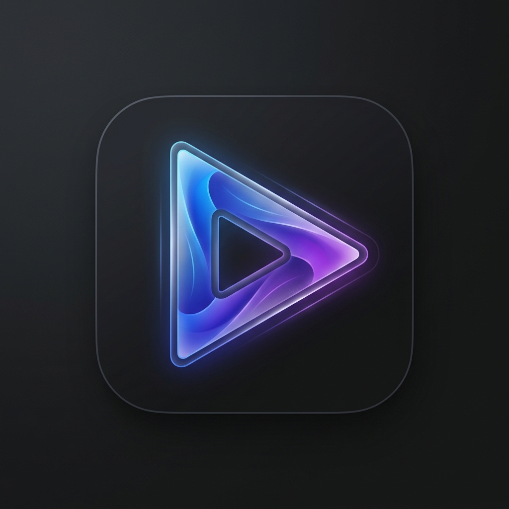

# 🪃 Boomerang Player

A high-performance, frame-accurate video player built for Windows 11. Designed for professional motion analysis, sports coaching, and frame-perfect annotation.

<p align="center">
  
</p>

## 🌟 Core Pillars & Features

### 1. 🎯 Precision Playback & Analysis
*   **Frame-Accurate Zero-Drift**: Real-time rendering engine powered by `ffprobe` metadata. Zero-drift playback ensures the UI counters, timeline sliders, and video frames are always in 100% sync.
*   **Dual-Direction Playback**: Independent forward and backward play buttons with instant direction switching.
*   **Variable Playback Speed**: Smooth, cached playback adjustable from **10% to 400%** speed.
*   **HDR-to-SDR Tone Mapping**: Automatic detection of HDR10 (PQ) and HLG color profiles. Integrates `zscale` and `tonemap` filters to convert high dynamic range footage into correct, vivid SDR colors on standard displays.

### 2. 🎨 Professional Annotation Suite
*   **Vector Drawing Tools**: Direct viewport annotations using lines, arrows, rectangles, ellipses, and custom text.
*   **Laser Mode**: Interactive temporary drawing mode. Strokes and annotations automatically fade away after interaction—perfect for live presentations, screen shares, and coaching.
*   **Transactional Undo/Redo**: Deep history tracking of individual strokes, modifications, and eraser paths.

### 3. 🔄 Advanced Navigation & Synchronization
*   **Multi-Segment Looping**: Define custom A/B markers to isolate and repeat specific video sequences.
*   **Timeline Zoom Modes**: Focus your progress bar navigation using mutually exclusive modes:
    *   *Zoom to Loop*: Restricts the timeline slider to the active loop range.
    *   *Zoom to Window*: Restricts the timeline slider to a configured frame window around a specific anchor frame.
*   **Multi-Instance UDP Sync**: Peer-to-peer network synchronization using multicast UDP. Syncs playback states, speed adjustments, and frame seeking across multiple running instances of the player (ideal for multi-angle video analysis).
*   **Interactive Pan & Zoom**: High-performance canvas zooming and cursor-anchored panning for examining details.

### 4. 🗂️ Smart Workflow & Personalization
*   **State Persistence**: Automatically remembers your playback position, zoom level, marker ranges, and color adjustments individually for each video file.
*   **Playlist & Project Files**: Modern sidebar playlist with drag-and-drop media loading. Custom thumbnails can be set from the current frame. Save and load playlists with embedded thumbnail assets using `.bpl` project files.
*   **Windows 11 Integration**: Themed with native glassmorphic styles, dark/light modes, customizable accent colors, and DWM titlebar coloring.

## 🚀 Getting Started

### Prerequisites
- **Python 3.10+**
- **FFmpeg & FFprobe**: Included in pre-built releases. If running from source, ensure they are in your PATH.

### Quick Start
1. Clone the repository:
   ```bash
   git clone https://github.com/farkasszte/boomerangplayer.git
   cd win11-video-player
   ```
2. Install dependencies:
   ```bash
   pip install PyQt6 qfluentwidgets numpy
   ```
3. Launch:
   ```bash
   python main.py
   ```

## 🛠️ Building
To create a portable, single-file Windows executable:
```bash
python build_dist.py
```
*The build includes all icons, translations, and FFmpeg binaries.*
